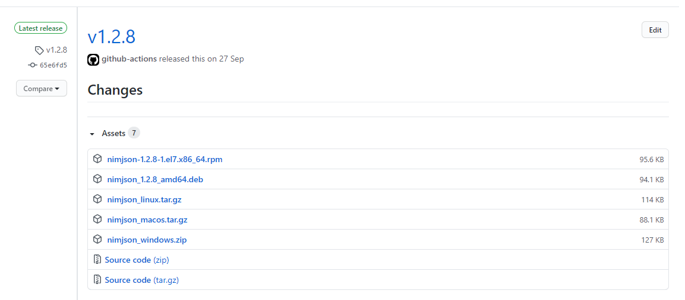

# GitHub Releasesからインストールしたコマンドを管理する

発表者: 次郎 (@jiro_saburomaru)
<!-- 30秒 -->

---

## 目次

1. 自己紹介
1. GitHub Releasesについて
1. relma の使い方
1. relma の仕組み
1. まとめ
<!-- 1分 -->

---

## 自己紹介


| Key | Value |
| --- | ----- |
| 名前 | 次郎 |
| Twitter | [@jiro_saburomaru](https://twitter.com/jiro_saburomaru) |
| 職業 | サーバサイドエンジニア |
<!-- 1分10秒 -->

---

## GitHub Releasesについて

---

皆様はGitHub Releasesを使ってますか？

GitHub Releases便利なので、僕は大変活用させてもらっています。

GitHub Releasesは開発者にとっても、リポジトリを訪れた人(以降ユーザ)にとっても、手軽に使える素晴らしい機能だと感じています。
<!-- 1分30秒 -->

---

GitHub Releasesご存知ない方のために軽く説明すると

- GitHubのリポジトリに紐づく、任意のファイルをユーザに提供できる機能
    - [リポジトリのリリースを管理する - GitHub Docs](https://docs.github.com/ja/free-pro-team@latest/github/administering-a-repository/managing-releases-in-a-repository)
- 「タグを付与された時点でのリリース物」として利用される場合がほとんど
    - 例: タグ `v1.0.1` のリリース物
- よくあるリリース物は以下
    - 各OS用の実行可能ファイル
    - コードから生成したフォントファイル
- 圧縮ファイル (zip, tar.gz) の場合が多い
    - たまにバイナリそのまま
<!-- 2分00秒 -->

---

参考


<!-- 2分10秒 -->

---

### なにが便利か

開発者

- 無料で使える
- リリースファイルのアップロードが容易
- CI (GitHub Actions, Travis CIなど)と連携して自動リリース可能

ユーザ

- 無料で使える
- 簡単にダウンロードできる
<!-- 2分40秒 -->

---

僕は主にGitHub Releasesにだけ公開されているコマンドのダウンロードに使っています

有名なコマンドなどは `apt install` できたりするものもありますが、
GitHub Releasesだけに公開されているコマンドも多いです。
<!-- 3分00秒 -->

---

### 管理に悩む

こういったGitHub Releasesから取得するタイプのコマンドをインストールする時、僕は以下のようなコマンドを実行します。

```bash
cd /tmp
wget https://github.com/jiro4989/nimjson/releases/download/v1.2.8/nimjson_linux.tar.gz
tar xzf nimjson_linux.tar.gz
mkdir -p ~/bin
install -m 0755 ./nimjson_linux/bin/nimjson ~/bin/
```

インストールする時は特にこれで不便ありません。
<!-- 3分20秒 -->

---

ですが、コマンドをアップグレードしたくなった時に困りました。
主に以下の問題に遭遇しました。

- このコマンドどこから取得したっけ？
- どうやってインストールしたっけ？
- そもそも新しいバージョン出てるんだっけ？

この問題はGitHub Releasesから取得するコマンドが増えるほど大きくなりました
<!-- 3分50秒 -->

---

「debianパッケージみたいに `apt install` でインストールできて、
 `apt update` して `apt upgrade` でバージョン更新できたらいいのになぁ...」と感じるようになりました。

 ですがGitHub Releasesはタグに紐づくリリース物を公開する機能であって、
 リリース物をユーザがどう管理するかについては責務外と思います。

僕の「debianパッケージみたいに管理したい」がそもそも責務外の無茶な要求というものです。
<!-- 4分20秒 -->

---

ということで、作りました。

GitHub Releasesでインストールしたコマンドの一括アップグレードを可能にするコマンドです。

名前は `relma` (レルマ) としました。

https://github.com/jiro4989/relma
<!-- 4分40秒 -->

---

## relma の使い方

---

### インストール方法

最初に `init` で初期化して、 `install` にリリース物のURLを渡してあげるだけです。

これでリリース物の圧縮ファイルを展開して `$HOME/relma/bin` に実行可能ファイルのシンボリックリンクが配置されます。

```bash
relma init
relma install https://github.com/jiro4989/nimjson/releases/download/v1.2.8/nimjson_linux.tar.gz
```
<!-- 5分10秒 -->

---

### アップグレード方法

以下の様に `update` して `upgrade` するだけです。

`update` では最新バージョンの有無をチェックし、バージョン情報をローカルに保存します。
`upgrade` を実行するとアップグレード可能なパッケージをすべてアップグレードします。

```bash
relma update
relma upgrade
```
<!-- 5分30秒 -->

---

### インストールしたパッケージの確認方法

relma でインストールしたパッケージの一覧を確認する場合は `list` を実行します。

```bash
relma list
```
<!-- 5分40秒 -->

---

## relma の仕組み

---

### インストール方法

`relma install` に渡したURLのファイルをローカルに落し、所定のパスに展開してシンボリックリンクを作ります。

```bash
$HOME/
    relma/
        bin/
            command.exe # シンボリックリンク
        releases/
            $OWNER/
                $REPO/
                    $VERSION/
                        $RELEASE_FILE.tar.gz
                        assets/
                            command.exe # 実体
```
<!-- 6分00秒 -->

---

リリースファイルの展開後のディレクトリ構造にはある程度パターンがあります。

大体は以下の 3 パターンのいずれかだろう、と考えました。

これらの展開後のディレクトリ構造を判別して実行可能ファイルのパスを特定し、 `$HOME/relma/bin` 配下にシンボリックリンクを作成します。
<!-- 6分30秒 -->

```bash
release_v1.0.0.zip/
    command.exe         # コマンドだけ配置されるケース

release_v1.0.0.zip/
    release_v1.0.0/
        command.exe     # 圧縮ファイル名のディレクトリ配下に
                        # コマンドが配置されるケース

release_v1.0.0.zip/
    release_v1.0.0/
        bin/
            command.exe # 圧縮ファイル名のディレクトリ配下に
                        # bin ディレクトリが配置され、
                        # その下にコマンドが配置されるケース
```

---

### アップグレード時のインストールURLの特定方法

GitHub Releasesで公開されているコマンドの多くは、リリース手順を自動化されています。

ローカルで手動で叩くコマンドか、あるいはCIからか、手段は違えど大なり小なり自動化されている場合が多いです。

また、リリースファイルの命名も、リポジトリごとに違えど、概ね命名が決まっていて、「リリースファイル名に含まれるバージョン番号だけが異なる」という点で共通点があります。
<!-- 7分00秒 -->

---

よって、 `relma install` に指定したURLのバージョン番号をリリースのタグ番号で差し替えれば、次のバージョンのリリースファイルを取得するURLが特定できるのでは、と考えました。

```bash
https://github.com/jiro4989/nimjson/releases/download/${VERSION}/nimjson_${VERSION}_linux.tar.gz
```
<!-- 7分10秒 -->

---

しかし、開発者が毎回手動でリリースファイルを作っていて、命名が不規則だったり、タグとバージョン番号が不一致になるケースもあると思います

これは対象外としました。

あらゆるリポジトリをサポートするつもりはないですし、命名が不規則なのはリポジトリのオーナーの管理の問題と考えます。

8割くらいのリポジトリをカバーできれば、僕は満足です。
<!-- 7分30秒 -->

---

実際に操作を見てみます。

（ここで実際に操作）
<!-- 9分30秒 -->

---

## まとめ

- GitHub Releasesの話をしました
- relma コマンドの使い方を説明しました
- relma コマンドの仕組みを説明しました

皆様のお役に立てば幸いです。

以上
<!-- 10分00秒 -->