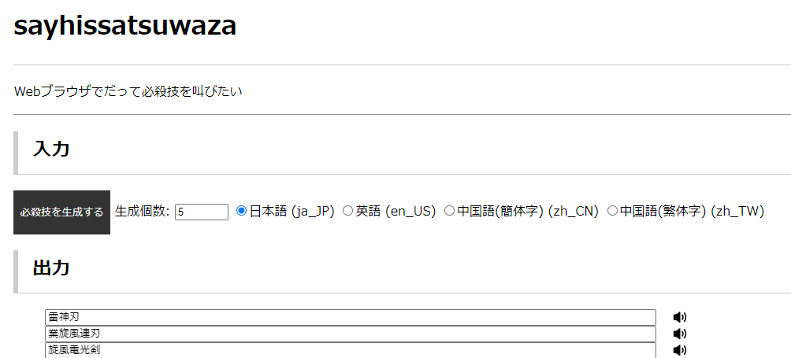

# 必殺技名をプログラムで生成する

発表者: 次郎 (@jiro_saburomaru)

---

## 目次

1. 自己紹介
1. ことの発端
1. 必殺技とは
1. 必殺技を考えてみる
1. 必殺技を生成してみる
1. まとめ

---

## 自己紹介


| Key | Value |
| --- | ----- |
| 名前 | 次郎 |
| Twitter | [@jiro_saburomaru](https://twitter.com/jiro_saburomaru) |
| 職業 | サーバサイドエンジニア |

---

## ことの発端

---

ある休日の朝、唐突に**必殺技名をプログラムで生成したい**と思い立ちました

_終わり_

---

必殺技をプログラムで生成するためには

必殺技を理解しないといけない

ということで、いろんな必殺技を調べてみることに

---

## 必殺技とは

---

Wikipediaでは必殺技のことを以下のように説明しています

[必殺技 - Wikipedia](https://ja.wikipedia.org/wiki/%E5%BF%85%E6%AE%BA%E6%8A%80)

> 必殺技（ひっさつわざ）とは、敵と戦う上で持ち合わせている技術・武器・技などのうちで大打撃を与える威力や破壊力を持つもののこと[1]である。字義的には「必ず殺す技」と解釈できるが、必ずしも相手の命を奪う技とは限らず「必ず殺“さない”技」とも解釈できる。商標として出願された事がある（後述）。

これだけではちょっと名前のイメージがつかないので、いろんな必殺技を探してみます

---

いろんな必殺技 漢字系

| 名前 | 作品元 |
| --- | --- |
| 昇龍拳 | ストリートファイター |
| 夢幻闘舞 | ファイナルファンタジー6 マッシュ |
| 邪王炎殺黒龍波 | 幽遊白書 飛影 |
| 殺劇舞荒剣 | テイルズオブデスティニー スタン・エルロン |
| 烈火武神撃 | 魔界戦記ディスガイア2 アデル |
| 奥義･吼龍連舞撃 | サモンナイト4 セイロン |

---

いろんな必殺技 英語系

| 名前 | 作品元 |
| --- | --- |
| サンダークロススプリットアタック | ジョジョ1部 ダイアー |
| ハンズ・オブ・グローリー | GS美神 横島忠夫 |
| ジャッジメントチェーン | ハンターハンター クラピカ |
| ジェットストリームアタック | 機動戦士ガンダム 黒い三連星 |
| ワールドデストロイヤー | テイルズオブデスティニー バルバトス |

---

いろんな必殺技 造語系

| 名前 | 作品元 |
| --- | --- |
| ミナデイン | ドラゴンクエスト |
| アルテマ | ファイナルファンタジー |
| アバンストラッシュ | ドラゴンクエストダイの大冒険 アバン |
| バオウ・ザケルガ | 金色のガッシュ ガッシュベル |

---

漢字系と英語系については命名規則がある程度あるように見える

- 昇龍拳
  - 龍が昇るような拳
- 夢幻闘舞
  - 夢幻のような闘舞
- 邪王炎殺黒龍波
  - 黒い龍のような波 (衝撃波)
- 殺劇舞荒剣
  - 荒れ狂う舞のような剣 (剣撃)

→ 形容する単語 + オブジェクトor動作 の組み合わせで表現される場合が多い

---

## 必殺技を考えてみる

形容する単語 + オブジェクトor動作 で必殺技を考えてみる

---

- 火炎のような剣 → 火炎剣
- 魔神のような遊戯 → 魔神遊戯
- 疾風のような連撃 → 疾風連撃

それっぽさがある

---

## 必殺技を生成してみる

命名規則が見えたなら、あとはプログラムに起こすだけ。

```bash
$ echo {爆炎,紅蓮,魔神}{剣,刃,拳}
爆炎剣 紅蓮剣 魔神剣 爆炎刃 紅蓮刃 魔神刃 爆炎拳 紅蓮拳 魔神拳
```

ただし、単純に総当りで組み合わせると、発音的に微妙なものがいくつかある

↑の例だと 魔神刃 (まじんじん) とか

---

細かい調整がしたかったのと
いろんな環境で動作する実行可能ファイルとして配布したかったので
別の言語で作ることに。

ということで Nim で必殺技を生成するコマンド **sayhissatsuwaza** を作りました

<https://github.com/jiro4989/sayhissatsuwaza>

---

### sayhissatsuwaza

```bash
$ sayhissatsuwaza
旋風刃
```

で必殺技を生成する。日本語と英語と中国語に対応。

名前の由来は ~~sayhuuzoku~~ cowsay です。

cowsay は「牛がしゃべる」なので、
「必殺技をしゃべる」で sayhissatsuwaza にしました。

---

必殺技を喋れるようになれば、他のコマンドとも連携できる。

```bash
$ sayhissatsuwaza | echo-sd -s
＿人人人人人＿
＞　炎業撃　＜
￣Y^Y^Y^Y^Y^￣

$ sayhissatsuwaza | cowsay
 __________________
< ストームスラスト >
 ------------------
        \   ^__^
         \  (oo)\_______
            (__)\       )\/\
                ||----w |
                ||     ||
```

---

あとWeb版も作りました。
NimだとJavaScriptにトランスコンパイルできるので、GitHub Pagesでも動く。

<https://jiro4989.github.io/sayhissatsuwaza/>



---

## まとめ

- 必殺技の規則性を調べた
- sayhissatsuwaza コマンドで必殺技を喋れるようになった
  - <https://github.com/jiro4989/sayhissatsuwaza>

これでいつでも必殺技ができるよ！やったね！

以上
