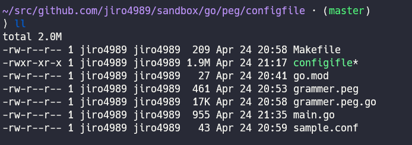
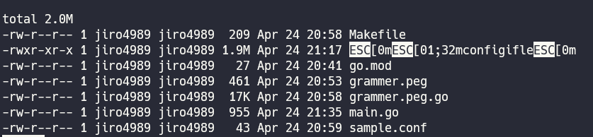

# PEGで構文解析をする

発表者: 次郎 (@jiro_saburomaru)

あるツールをリファクタするときにPEGが便利だった話をします。

---

## 目次

1. 自己紹介
1. PEG (Parsing Expression Grammar)
1. PEGの嬉しさ
1. PEGの使い所
1. まとめ

---

## 自己紹介


| Key | Value |
| --- | ----- |
| 名前 | 次郎 |
| Twitter | [@jiro_saburomaru](https://twitter.com/jiro_saburomaru) |
| 職業 | SRE |

---

## PEG (Parsing Expression Grammar)

---

ざっくり言うと「文法を定義して、テキストの構文解析をする文法」。実装からは独立している。類似の技術としてはYACCが該当する。

> Parsing Expression Grammar (PEG) は、分析的形式文法の一種であり、形式言語をその言語に含まれる文字列を認識するための一連の規則を使って表したものである。

引用: [Parsing Expression Grammar - Wikipedia](https://ja.wikipedia.org/wiki/Parsing_Expression_Grammar)

---

PEGにはパーサジェネレータが存在し、PEGの文法を食わせることで、その文法を解釈できるパーサを自動生成できる。

PEGのパーサジェネレータはすでに多数存在しており、様々なプログラミング言語用のジェネレーターが存在する。

今回のLTではGo言語用のパーサジェネレータの[pointlander/peg - GitHub](https://github.com/pointlander/peg)を使う。

---

例えば、PEGの文法に則って、以下のルールを定義した。
これは簡易な ini ファイル風の設定ファイル文法である。

```peg
root <- pair+

pair <- space key space '=' space value space delimiter

key   <- [a-zA-Z] [-_a-zA-Z0-9]*
value <- atom

atom   <- bool / int / string
string <- '"' ('\\' '"' / [^"])* '"'
int    <- '0' / [1-9] [0-9]*
bool   <- 'true' / 'false'

space     <- (' ' / '　' / '\t')*
delimiter <- '\n' / ';'
```

---

前述のルールでは、以下の設定ファイルを解釈できる。

```ini
name = "test_app"
port = 1234
debug = true
```

ただし、前述のルールだけでは、構文を解析できるだけで、値を取り出すことができない。
そこで、今回使うGo用のパーサジェネレータの独自の構文を使うことで値を取り出せるようにする。

---

peg独自の構文を付け足したものが以下。

```peg
package main

type Parser Peg {
  ParserFunc
}

root <- pair+

pair <- space key space '=' space value space delimiter

key   <- <[a-zA-Z] [-_a-zA-Z0-9]*> { p.pushKey(text) }
value <- atom

atom   <- bool / int / string
string <- '"' <('\\' '"' / [^"])*> '"' { p.pushString(text) }
int    <- <'0' / [1-9] [0-9]*>         { p.pushInt(text) }
bool   <- <'true' / 'false'>           { p.pushBool(text) }

space     <- (' ' / '　' / '\t')*
delimiter <- '\n' / ';'
```

---

これで構文解析と、値の取り出しをまとめてできるようになった。
コンパイラで言う字句解析と構文解析を一緒にやっている。意味解析はできない。
実際に設定ファイルを読み込んで、値が取り出せているか確認してみる。

```go
func main() {
	b, err := os.ReadFile("sample.conf")
	if err != nil {
		panic(err)
	}

	pf := ParserFunc{
		data: make(map[string]interface{}),
	}
	p := &Parser{
		Buffer: string(b),
		ParserFunc: pf,
	}
	if err := p.Init(); err != nil {
		panic(err)
	}
	if err := p.Parse(); err != nil {
		panic(err)
	}
	p.Execute()
	for k, v := range p.ParserFunc.data {
		fmt.Printf("key = %s, value = %v, type = %s\n", k, v, reflect.TypeOf(v))
	}
}
```

---

実行結果は以下のようになる。期待通り、KeyとValueと型情報が取り出せている。

```bash
⟩ cat sample.conf
name = "test_app"
port = 1234
debug = true

⟩ ./configifle
key = port, value = 1234, type = int
key = debug, value = true, type = bool
key = name, value = test_app, type = string
```

---

ここまでで使ったサンプルコードはすべて以下のGistにまとめている。

気になった方は参考にしてみてください。

https://gist.github.com/jiro4989/668bd841e484eda7959bc027fb891da0


---

## PEGの嬉しさ

---

PEGを使う場合は文法を書くだけで良い。

コードの実装はジェネレーターに任せられるため、実装コストが安くなる。

また、PEGの文法を読むだけで、どのような文法を解釈できるのかが一意に判断できるため、可読性も高い。

---

PEGを使わない場合は、自力でLexer(字句解析器)とParser(構文解析器)を実装する必要がある。

自分でやるにはなかなか大変。

---

## PEGの使い所

---

PEGが構文解析に有用であることを今まで話した。

とはいえ、「別にプログラミング言語や設定ファイルを自作することなんてそうそうないし、使い所は限られているのでは？」と思うかもしれない。

---

しかし、そんなことはない。

シェル芸人なら日常的に目にしているであろう、**アレ**を解析するのにPEGは役立つ。

---

しかし、そんなことはない。

シェル芸人なら日常的に目にしているであろう、**アレ**を解析するのにPEGは役立つ。

そう、 **ANSIエスケープシーケンス** である。

---

ANSIエスケープシーケンスに関する話は、2019年8月の第43回シェル芸勉強会のLTで発表したので今回は割愛する。

[ANSIエスケープシーケンスで遊ぶ - /home/jiro4989](https://scrapbox.io/jiro4989/ANSI%E3%82%A8%E3%82%B9%E3%82%B1%E3%83%BC%E3%83%97%E3%82%B7%E3%83%BC%E3%82%B1%E3%83%B3%E3%82%B9%E3%81%A7%E9%81%8A%E3%81%B6)


---

ターミナル上でテキストに色がついて表示されているのは、ターミナルがANSIエスケープシーケンスを解釈しているから。



---

具体的には、以下のようなテキスト

`\x1b[31mGREEN\x1b[m`

```bash
⟩ ls -lah --color=always | less
```



---

ANSIエスケープシーケンスのコード定義は man にかかれている。

`man console_codes`

https://man7.org/linux/man-pages/man4/console_codes.4.html

定義上はANSIエスケープシーケンスのCSIと値、mは SGR (Select Graphic Rendition) Parameter が正式名称。

---

`\x1b[31m GREEN \x1b[m` で緑色になる

これってまさに構文解析と同じ。

つまりPEGの出番。

---

基本形

`\x1b[31m` (standard_color) で緑色になる

prefix color suffix という3部分で構成。

```peg
colors <-
  prefix color suffix

prefix <-
  '\e' '['

color <-
  ([349] / '10') [0-7]

suffix <- 'm'
```

セミコロン区切りで複数の色を同時に定義できる。

`\x1b[31;42m`

```peg
colors <-
  prefix color (delimiter color)* suffix

prefix <-
  '\e' '['

color <-
  ([349] / '10') [0-7]

suffix    <- 'm'
delimiter <- ';'
```

色以外のテキストも存在する。

```peg
colors <-
  prefix color (delimiter color)* suffix

prefix <-
  '\e' '['

color <-
  ([349] / '10') [0-7]

text <- [^\e]+

suffix    <- 'm'
delimiter <- ';'
```

色か、テキストが0個以上連続する。

```peg
root <- (colors / text)*

colors <-
  prefix color (delimiter color)* suffix

prefix <-
  '\e' '['

color <-
  ([349] / '10') [0-7]

text <- [^\e]+

suffix    <- 'm'
delimiter <- ';'
```

こんな具合に文法を徐々に拡張していくだけで良い。

最終的な文法は以下。
68行程度

https://github.com/jiro4989/textimg/blob/master/parser/grammer.peg

---

## まとめ

- 必殺技の規則性を調べた
- sayhissatsuwaza コマンドで必殺技を喋れるようになった
  - <https://github.com/jiro4989/sayhissatsuwaza>

これでいつでも必殺技ができるよ！やったね！

以上
